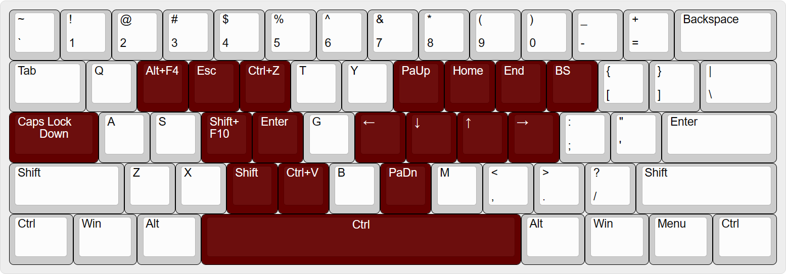

### Useful KeyBoard
[中文](README_CN.md) [English](README.md)

On the Windows platform, you can enhance the functionality of your keyboard by using AutoHotkey. By combining various features, you can create a powerful custom keyboard.

#### Technologies Used
- AutoHotkey

#### Platform
- Windows

<!-- #### Personal Solution
Customizing keyboard functionality is a matter of personal preference, and there are many complex features involved.

> However, there are some bugs in the script that I couldn't resolve:
>
> - When pressing `CapsLk` along with other operations, the script is prone to crashes and occasionally sends disabled keystrokes. It may result in the toggle between uppercase and lowercase being controlled by the semicolon key (`;`), which is quite strange.

#### Modification of Long-Press Functions for `;` and `/`

- Modify the long-press function for `;` (while keeping the short-press function unchanged) to act as the `Ctrl` key.
- Modify the long-press function for `/` (while keeping the short-press function unchanged) to act as the `Shift` key.

#### Modification of Caps Lock Key
- Disable the original functionality of the `Caps Lock` key.
- Enter a super mode when the key is long-pressed.

#### Super Mode

To activate the super mode, simply **long-press** the `Caps Lock` key (no need to release it like in Vim). When the `Caps Lock` key is pressed, the keyboard's functionality changes as follows:

- `h`/`j`/`k`/`l` for **left**/**down**/**up**/**right** movement (similar to Vim's navigation).
- `i`/`o` for `Home`/`End` (move to the beginning/end).
- `u`/`n` for `PgUp`/`PgDn` (previous page/next page).
- `d` for `Shift` + `F10` (quickly open context menu).
- `w` for `Alt` + `F4` (close program or window).
- `e` for `Esc` (cancel).
- `r` for `Ctrl` + `z` (undo).
- `p` for `Backspace` (delete).
- `v` for `Shift` + `Insert` (paste).
- `c` for `Shift` (used for multiple selections and other operations).
- `Space` for `Ctrl`.

#### One-Handed Mode
> Use `caps lock` + `Alt` + `f` to enable **one-handed mode**.

- Use `q`/`e` to navigate **up**/**down** the page.
- Use `w`/`s`/`a`/`d` to navigate **up**/**down**/**left**/**right**. -->

<!-- #### Ideas
- Make it more user-friendly.
- Add a graphical interface.
- Allow simple customization of hotkey functions. -->

#### Installation
**Method 1: Without installing any software**
Simply download and run [usefulKB.exe](usefulKB.exe).

**Method 2: Installing AutoHotkey**
1. Download and install [AutoHotKey](https://www.autohotkey.com/).
2. Press `Win` + `R` to open the Run dialog, and enter the following command:
```
shell:startup
```
This will open the Startup folder. Place the [usefulKB.ahk](usefulKB.ahk) file in this folder to enable auto-startup of the AutoHotKey script.

#### Acknowledgements

- [jasonrudolph/keyboard: ⌨ Toward a more useful keyboard (github.com)](https://github.com/jasonrudolph/keyboard#a-more-useful-caps-lock-key)
- [boppreh/keyboard: Hook and simulate global keyboard events on Windows and Linux. (github.com)](https://github.com/boppreh/keyboard#keyboard.on_press)
- [rcmdnk/vim_ahk：使用自动热键设置文件以模拟 vim (github.com)](https://github.com/rcmdnk/vim_ahk)
- [xiongyihui/keyboard: 解开键盘封印，释放生产力 (github.com)](https://github.com/xiongyihui/keyboard)
- [自用ahk热键脚本及相关回顾 - AutoHotkey Community](https://www.autohotkey.com/boards/viewtopic.php?f=28&t=85872&p=377029&hilit=%E7%83%AD%E9%94%AE%E8%BF%9E%E7%BB%AD%E6%8C%89%E4%BC%9A%E8%AF%AF%E8%A7%A6#p377029)
- [AutoHotkey/AutoHotkey: AutoHotkey - macro-creation and automation-oriented scripting utility for Windows. (github.com)](https://github.com/AutoHotkey/AutoHotkey)
- [rcmdnk/vim_ahk: Setting file to emulate vim with AutoHotkey (github.com)](https://github.com/rcmdnk/vim_ahk)

Please translate and optimize the text based on your experience writing `README.md` files.